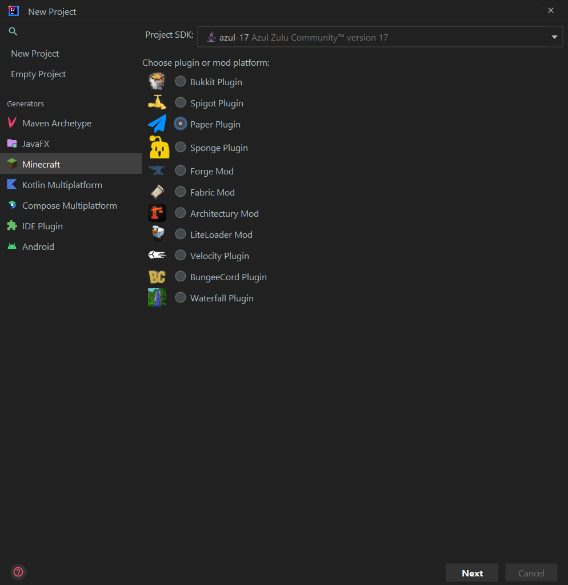
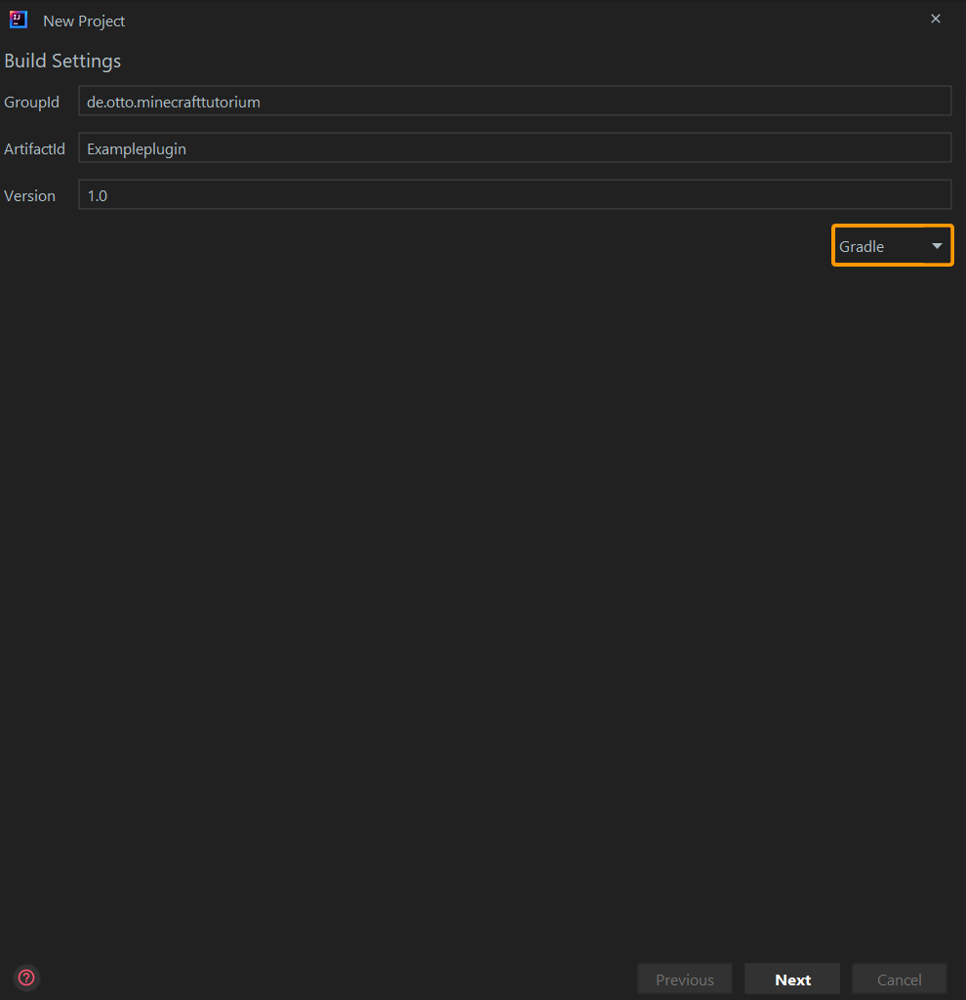

[Zurück zur Hauptseite](../README.md)

# Eigenes Projekt anlegen

## New Project

- Im Kontextmenü "Minecraft" auswählen
- "Paper Plugin" wählen
- Darauf achten, dasss die Projekt SDK auf Java 17 eingestellt ist.

## Build Settings

- GroupId & ArtifactId angeben
- "Gradle" auswählen

## Paper Settings

- Minecraft Version auf "1.19.2" einstellen

